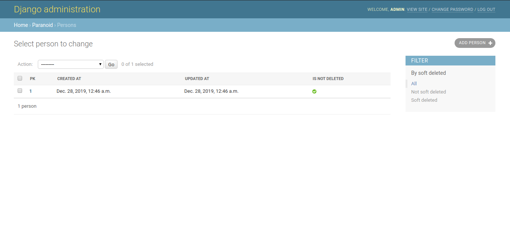
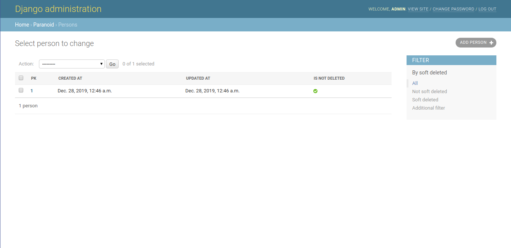

# Django Admin

### Register your models

To register your model on django admin, is recomended to let ParanoidAdmin handle with admin action. Otherwise you may have
some trouble.

ParanoidAdmin also include some aditional methods to look more "paranoid" on admin page, some functions are:

- Delete: soft delete instance

- Permanently delete: hard delete

- Restore: remode deleted_at date

- Filter: filter all, only deleted, not deleted

On you `admin.py` register you models like the example below:

```py
# admin.py

from paranoid_model.admin import ParanoidAdmin
from .models import MyModel

admin.site.register(MyModel, ParanoidAdmin)
```

This will allow ParanoidAdmin to handle with admin actions.

Once done that, it should looks something like this:



### Customize list

You can customize the way objects are displayed changing the attribute `list_display` on admin. To do that, you're gonna
have to make an inheritance of ParanoidAdmin and change this attribute.

```py
# admin.py

from paranoid_model.admin import ParanoidAdmin
from .models import MyModel


class MyAdmin(ParanoidAdmin):
    list_display = ('__str__',)  # Django's Default display when list


admin.site.register(MyModel, MyAdmin)
```

This is how it will look like:


If you like the Paranoid's default list display but just want to add some more attributes, you can do the following:

```py
class MyAdmin(ParanoidAdmin):
    list_display = ('name', 'phone',) + ParanoidAdmin.list_display
```

[Checkout Official Docs here](https://docs.djangoproject.com/en/3.0/ref/contrib/admin/#django.contrib.admin.ModelAdmin.list_display)

### Customize filter

You can customize filter window as you want like remove, add more filter.

**Add more filter:**

```py
# admin.py

from paranoid_model.admin import ParanoidAdmin
from .models import MyModel


class MyFilter(ParanoidAdminFilter):

    def lookups(self, request, mode_admin):
        # Method to get tuple with all (`search_param`, `name to show`)
        # to list on filter window

        return super().lookups(request, mode_admin) + (
            ('additional', 'Additional filter'),  # add aditional filters to super() filter
        )

    def queryset(self, request, queryset):
        # Method to handle the querrying and return the QuerySet[]
        # to be showed on site

        if self.value() == 'additional':
            # filter additional objects
            pass
        else:
            # Not one of our additionals querry
            return super().queryset(request, queryset)


class MyAdmin(ParanoidAdmin):
    list_filter = (MyFilter,)  # Use our list filter created just above


admin.site.register(MyModel, MyAdmin)
```

Look at the result:



[Checkout Official Docs here](https://docs.djangoproject.com/en/3.0/ref/contrib/admin/#django.contrib.admin.ModelAdmin.list_filter)

**Remove filter window:**

Remove filter window is a peace of cake

```py
# admin.py

from paranoid_model.admin import ParanoidAdmin
from .models import MyModel


class MyAdmin(ParanoidAdmin):
    list_filter = ()  # set list_filter with 0 filter inside


admin.site.register(MyModel, MyAdmin)
```

And if you also set `list_display` to be Django's default it will be just like Django's default model page.

```py
# admin.py

from paranoid_model.admin import ParanoidAdmin
from .models import MyModel


class MyAdmin(ParanoidAdmin):
    list_display = ('__str__',)  # list like django
    list_filter = ()  # remove filter window


admin.site.register(MyModel, MyAdmin)
```

Django's default view:


